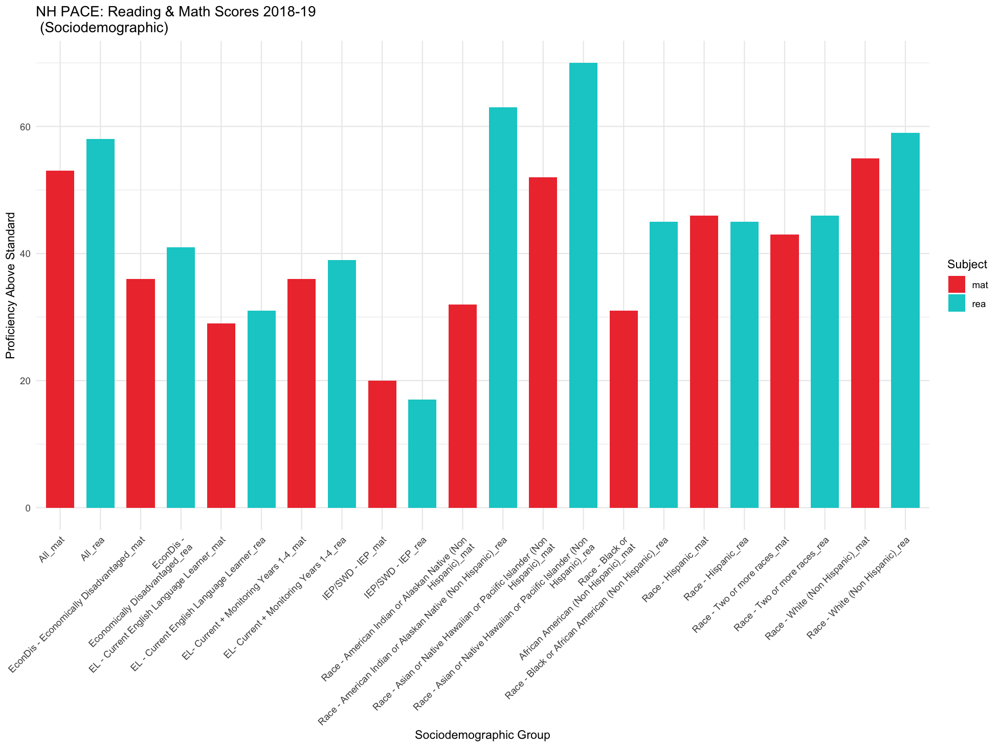

## Portfolio

---

### Data Projects 

<a href="https://taylor-true.github.io/NH-pace/">New Hampshire 2018-2019 PACE Pilot Program: Disaggregated Data Visualization</a>  

---
<a href="https://showspace.so/p/8883?refPageType=user&refPageLabel=Taylor%20True&refPageSlug=taylor-true-56">PISA 2018: Reading Scores and "Life Satisfaction" - Educational Data Mining</a>  

---
<a href="https://taylor-true.github.io/gis-kentucky-climate/">Interactive GIS Visualization: Kentucky School Climate Index Scores by County</a>   

---

### Art & Design

<a href="https://taylor-true.github.io/portfolio-template/">(Static HTML/CSS) Visual Artist Portfolio - Template/Sample</a>  
 

---

### Articles & Reports

- [Undergraduate Writing Samples](https://u.osu.edu/true.25/)
    
(More coming soon!)

---

---

Page template forked from <a href="https://github.com/evanca/quick-portfolio">evanca</a>

<!-- Remove above link if you don't want to attibute -->
